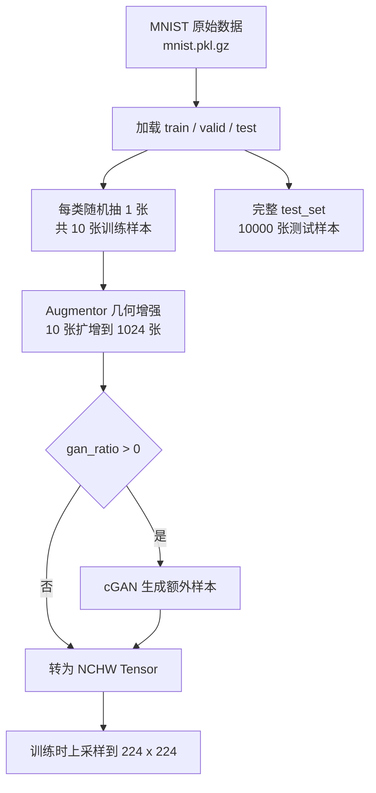

# RMNIST 数据集构造方式

本文档记录本项目中 RMNIST 数据集的构造流程。当前实现以 MNIST 手写数字数据为基础,通过 one-shot 采样、几何增强和可选的 cGAN 生成增强构造小样本训练集。

## 1. 原始数据

原始数据来自 MNIST pickle 文件:

| 项目 | 说明 |
| --- | --- |
| 下载文件 | `mnist.pkl.gz` |
| 本地缓存 | `./data/mnist.pkl.gz` |
| 数据格式 | gzip 压缩 pickle |
| 图像尺寸 | `28 x 28` 灰度图 |
| 单样本形状 | 展平为 `784` 维向量 |
| 像素范围 | `[0, 1]` |
| 类别数 | 10 类,标签为 `0` 到 `9` |

加载后得到三个子集:

| 子集 | 样本数 | 用途 |
| --- | --- | --- |
| `train_set` | 50,000 | one-shot 采样来源 |
| `valid_set` | 10,000 | 当前流程未使用 |
| `test_set` | 10,000 | 完整测试集 |

## 2. One-Shot 训练集构造

`make_dataset()` 从完整训练集中为每个数字类别随机抽取 1 张样本,最终得到 10 张训练图像。

构造逻辑如下:

```python
train_idx = []
for label in range(10):
    idx_list = np.where(full_train_y == label)[0]
    train_idx.append(np.random.choice(idx_list))

train_x = full_train_x[train_idx]
train_y = full_train_y[train_idx]
```

输出数据为:

| 名称 | 形状 | 说明 |
| --- | --- | --- |
| `train_x` | `(10, 784)` | 每类 1 张训练样本 |
| `train_y` | `(10,)` | 训练标签 |
| `test_x` | `(10000, 784)` | 完整测试图像 |
| `test_y` | `(10000,)` | 测试标签 |

随机抽样由 `--seed` 控制。训练入口会设置 `np.random.seed(args.seed)`,因此同一个 seed 会得到相同的 10 张 one-shot 样本。

## 3. 几何增强构造训练集

深度学习训练前,`preprocess()` 会先将 `train_x` 从 `(N, 784)` 还原为 `(N, 28, 28, 1)`,再使用 Augmentor 将 10 张样本扩增为 1024 张。

增强配置如下:

| 增强方式 | 概率 | 参数 |
| --- | --- | --- |
| 旋转 | `0.5` | 左右最大 `10` 度 |
| 随机扭曲 | `0.8` | `3 x 3` 网格,幅度 `2` |
| 倾斜 | `0.8` | 幅度 `0.3` |
| 错切 | `0.5` | 左右最大 `3` |

增强后使用 `np.clip(train_x, 0, 1)` 将像素值截断到合法范围。默认几何增强后的训练集形状为:

| 名称 | 形状 | 说明 |
| --- | --- | --- |
| `train_x` | `(1024, 28, 28, 1)` | 增强后的训练图像 |
| `train_y` | `(1024,)` | 对应标签 |

## 4. cGAN 生成增强

当启动参数 `--gan_ratio > 0` 时,会继续调用 `gan_augment()` 生成额外样本。生成数量为:

```python
n_samples = int(gan_ratio * len(train_x))
```

生成出的 `a_x` 和 `a_y` 会与几何增强后的训练集拼接:

```python
train_x = np.concatenate([train_x, a_x])
train_y = np.concatenate([train_y, a_y])
```

如果 `gan_ratio = 0.1`,几何增强后的 `1024` 张样本会额外增加 `102` 张 cGAN 样本,训练集总量约为 `1126` 张。

## 5. 模型输入格式

训练前图像会从 NHWC 转为 PyTorch 常用的 NCHW:

```python
train_x = np.transpose(train_x, (0, 3, 1, 2))
test_x = np.transpose(test_x, (0, 3, 1, 2))
```

随后转换为 tensor:

| 名称 | 类型 | 形状 |
| --- | --- | --- |
| `train_x` | `torch.Tensor` | `(N, 1, 28, 28)` |
| `train_y` | `torch.LongTensor` | `(N,)` |
| `test_x` | `torch.Tensor` | `(10000, 1, 28, 28)` |
| `test_y` | `torch.LongTensor` | `(10000,)` |

使用 ResNet 训练时,图像会进一步通过 `F.interpolate(..., size=224)` 上采样到 `224 x 224`。

## 6. 构造流程总览



## 7. 关键约束

- 训练集的核心约束是每个类别只有 1 张原始样本。
- 测试集不做 one-shot 采样,始终使用完整 `test_set`。
- `valid_set` 当前未参与训练、调参或评估。
- 构造结果对随机种子敏感,比较实验时需要固定并报告 seed。