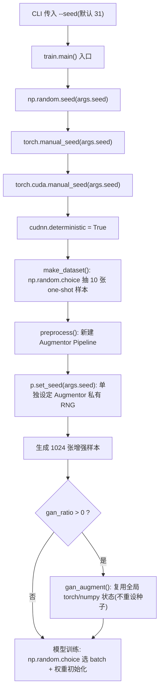

# 各库随机种子(seed)的设置时机

本文说明本项目中 **NumPy / PyTorch / cuDNN / Augmentor / GAN / 可视化** 各处随机种子的设置位置与时机,用于理解与保障实验可复现性。

---

## 1. 种子来源

所有随机性统一由命令行参数 `--seed`(默认 `31`)驱动,定义在 [src/train.py](src/train.py#L26) 的 `build_parser()`,运行时保存到全局变量 `args.seed`。

```bash
uv run oneshot train --seed 31
```

---

## 2. 设置时机总览

| 库 / 机制 | API | 设置位置 | 时机 | 作用域 |
| --- | --- | --- | --- | --- |
| NumPy | `np.random.seed(args.seed)` | [src/train.py](src/train.py#L231) `main()` | 程序入口,**早于**任何随机操作 | 进程级全局 |
| PyTorch (CPU) | `torch.manual_seed(args.seed)` | [src/train.py](src/train.py#L232) `main()` | 同上 | 进程级全局 |
| PyTorch (CUDA) | `torch.cuda.manual_seed(args.seed)` | [src/train.py](src/train.py#L233) `main()` | 同上 | 当前 GPU 设备 |
| cuDNN | `torch.backends.cudnn.deterministic = True` | [src/train.py](src/train.py#L234) `main()` | 同上 | 全局(强制确定性算法) |
| Augmentor | `p.set_seed(args.seed)` | [src/train.py](src/train.py#L76) `preprocess()`、[src/train.py](src/train.py#L159) `siamese_net()` | **每次**新建 `Pipeline` 后、生成样本前 | 该 Pipeline 实例私有 RNG |
| GAN | 无(见 §4) | [src/tools/gan_augment.py](src/tools/gan_augment.py#L34) | — | 复用全局 torch/numpy 状态 |
| 可视化 | `np.random.seed(seed)`(可选) | [src/visualization.py](src/visualization.py#L44) `visualize_training_samples()` | `make_dataset()` 之前,仅当显式传入 `seed` | 进程级全局 |

---

## 3. 训练主流程中的时序

核心原则:**先设种子,再做任何随机操作**。[src/train.py](src/train.py#L230) 的 `main()` 在调用 `make_dataset()` 之前一次性设定 NumPy / PyTorch / cuDNN 的种子。



---

## 4. 关键要点

- **各库的 RNG 相互独立**:NumPy、PyTorch、Augmentor 各自维护独立的随机状态,必须**分别**设定。`np.random.seed()` 既不影响 PyTorch,也不影响 Augmentor。
- **种子必须早于随机操作**:`main()` 在 `make_dataset()`(内部用 `np.random.choice` 采样,见 [src/datasets/rmnist.py](src/datasets/rmnist.py#L16))之前设定 NumPy 种子,才能保证同一 seed 得到相同的 10 张 one-shot 样本。
- **Augmentor 需按 Pipeline 单独设定**:Augmentor 使用实例级 RNG,因此每个 `Pipeline` 对象都要调用一次 `p.set_seed()`,项目在 `preprocess()` 与 `siamese_net()` 中各设一次。
- **GAN 的 `seed` 参数并未真正重设库种子**:[src/tools/gan_augment.py](src/tools/gan_augment.py#L34) 中 `gan_augment(x, y, seed, ...)` 的 `seed` **仅用于生成 checkpoint 文件名** `gan_checkpoint_{seed}.pth`;其内部的 `torch.randn` / `torch.randint` / `np.random.choice` 依赖 `main()` 已设定的全局状态。由于在此之前 Augmentor 生成、模型权重初始化等已推进过全局 RNG,因此 GAN 训练阶段的**逐位复现较为脆弱**,这是当前实现的一个注意点。

---

## 5. 可复现性增强建议(改进方向,未在代码中实现)

- **多 GPU**:改用 `torch.cuda.manual_seed_all(seed)` 覆盖所有设备。
- **Python 内置 `random`**:若后续引入 `random` 模块,需追加 `random.seed(seed)`。
- **cuDNN 基准**:配合设置 `torch.backends.cudnn.benchmark = False`,避免自动算法选择引入非确定性。
- **哈希随机化**:设置环境变量 `PYTHONHASHSEED=<seed>`。
- **DataLoader**:如引入 `DataLoader` 多进程加载,需提供 `worker_init_fn` 与固定的 `generator`。
- **GAN 复现**:如需严格复现 GAN,可在 `gan_augment()` 入口显式重设 `torch.manual_seed(seed)` / `np.random.seed(seed)`。
