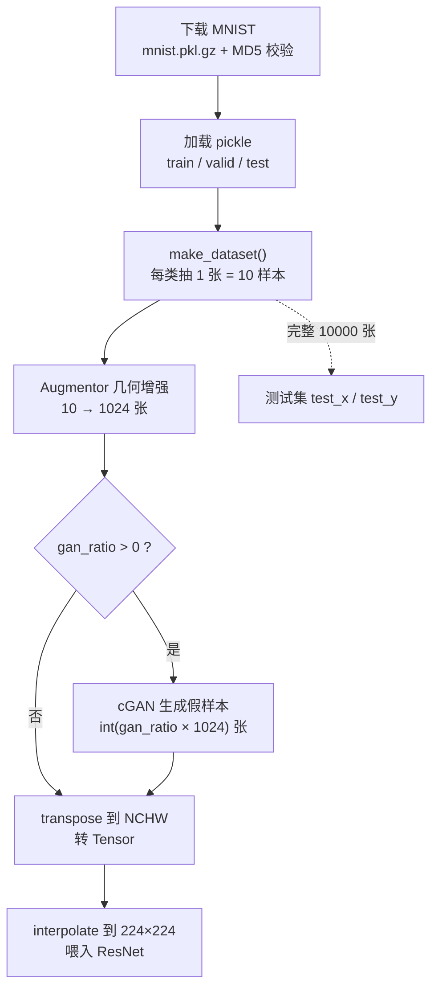

# MNIST One-Shot 数据集报告

## 1. 概述

本项目研究**极少样本(one-shot)**场景下的 MNIST 手写数字分类问题:训练集每个数字类别仅保留 **1 张**样本(0–9 共 **10 张**),测试集则使用完整的 MNIST 测试集(**10,000 张**)。由于训练样本极度稀缺,数据管线在原始采样之外引入了两级数据增强——**几何变换增强**与**条件 GAN(cGAN)生成增强**。

数据相关实现主要分布在:

- [`../tools/utils.py`](../tools/utils.py) — 下载、加载、one-shot 采样
- [`../train.py`](../train.py) — 预处理、几何增强、张量化
- [`../tools/gan_augment.py`](../tools/gan_augment.py) — cGAN 生成增强

---

## 2. 数据来源与格式

| 项目 | 说明 |
| --- | --- |
| 数据集 | MNIST 手写数字(类别 0–9) |
| 下载地址 | `http://deeplearning.net/data/mnist/mnist.pkl.gz` |
| 完整性校验 | MD5 `a02cd19f81d51c426d7ca14024243ce9` |
| 存储格式 | gzip 压缩的 pickle 文件(`latin1` 编码) |
| 单样本表示 | 28×28 灰度图,展平为 784 维向量 |
| 像素取值 | 已归一化到 `[0, 1]` 浮点数 |
| 本地缓存路径 | `./data/mnist.pkl.gz` |

下载逻辑见 `mnist()` 与 `download_url()`:先创建目录,若本地文件已存在且 **MD5 校验通过则跳过下载**,否则通过 `urlretrieve` 拉取并显示进度。加载时使用 `gzip.open` + `pickle.load` 解出三个子集。

---

## 3. 原始数据划分

标准 MNIST pickle 自带三划分:

| 子集 | 样本数 | 本项目用途 |
| --- | --- | --- |
| `train_set` | 50,000 | one-shot 采样来源 |
| `valid_set` | 10,000 | **未使用** |
| `test_set` | 10,000 | 测试评估(完整使用) |

---

## 4. One-Shot 采样(核心)

`make_dataset()` 是"one-shot"命名的由来。它从完整训练集中,**为每个类别随机抽取 1 张**样本:

```python
train_idx = []
for label in range(10):
    idx_list = np.where(full_train_y == label)[0]  # 该类别的全部索引
    train_idx.append(np.random.choice(idx_list))   # 随机抽 1 张
train_x, train_y = full_train_x[train_idx], full_train_y[train_idx]
```

采样输出:

| 张量 | 形状 | 说明 |
| --- | --- | --- |
| `train_x` | `(10, 784)` | 10 张训练样本 |
| `train_y` | `(10,)` | 对应标签 0–9 |
| `test_x` | `(10000, 784)` | 完整测试集 |
| `test_y` | `(10000,)` | 测试标签 |

> 抽取哪 10 张由随机种子 `--seed` 通过 `np.random.seed()` 决定,因此结果**完全可复现**;不同 seed 会得到不同的 10 张"代表样本",这也是后续实验方差的主要来源。

---

## 5. 数据增强

### 5.1 几何变换增强(Augmentor)

由于 10 张样本无法支撑深度网络训练,`train.py` 的 `preprocess()` 使用 [`Augmentor`](https://github.com/mdbloice/Augmentor) 将 10 张样本扩增为 **1024 张**:

| 变换 | 触发概率 | 参数 |
| --- | --- | --- |
| 旋转 `rotate` | 0.5 | 左右各最大 10° |
| 随机扭曲 `random_distortion` | 0.8 | 网格 3×3,幅度 2 |
| 倾斜 `skew` | 0.8 | 幅度 0.3 |
| 错切 `shear` | 0.5 | 左右各最大 3 |

增强后像素通过 `np.clip(0, 1)` 截断到合法范围。过程会落盘两张可视化图:原始样本 `origin-{seed}.png` 与增强样本 `data_augmentation.png`。

### 5.2 cGAN 生成增强(可选)

当命令行参数 `--gan_ratio > 0` 时,调用 `gan_augment()` 用**条件 GAN**额外生成 `int(gan_ratio × len(train_x))` 张带标签的假图,拼接进训练集:

```python
a_x, a_y = gan_augment(train_x, train_y, args.seed, n_samples)
train_x = np.concatenate([train_x, a_x])
train_y = np.concatenate([train_y, a_y])
```

cGAN 关键设置:

| 项 | 值 |
| --- | --- |
| 噪声维度 `z_dim` | 100 |
| 优化器 | Adam,`betas=(0.5, 0.999)` |
| 学习率 | G: `9e-4`,D: `3e-4` |
| 训练轮数 | 300 epoch,batch 64 |
| 损失函数 | `BCELoss` |
| 权重缓存 | `gan_checkpoint_{seed}.pth`(存在则直接加载生成,不重复训练) |

生成器 `Generator` 通过 `nn.Embedding(10, 10)` 将类别标签编码后与噪声拼接,实现**按标签条件生成**;判别器 `Discriminator` 同理拼接标签判别真假。生成样本可视化落盘为 `gan_data.png`。

---

## 6. 预处理与张量化流程

`preprocess()` 输出前的完整变换链:

1. 展平向量 `reshape` → `(N, 28, 28, 1)`(NHWC)
2. Augmentor 几何增强 → 1024 张
3. (可选)cGAN 生成样本拼接
4. `np.transpose` → `(N, 1, 28, 28)`(NCHW)
5. 转 `torch.Tensor` / `torch.LongTensor`
6. 训练/评估时用 `F.interpolate` 上采样到 **224×224**,以适配 ResNet 输入

---

## 7. 可复现性

`main()` 中统一固定随机源,保证实验可复现:

```python
np.random.seed(args.seed)
torch.manual_seed(args.seed)
torch.cuda.manual_seed(args.seed)
torch.backends.cudnn.deterministic = True
```

本项目使用三个种子进行多次实验:**31 / 317 / 31731**。

---

## 8. 数据流总览



---

## 9. 产物文件清单

| 文件 | 生成时机 | 内容 |
| --- | --- | --- |
| `./data/mnist.pkl.gz` | 首次运行 | MNIST 原始数据缓存 |
| `origin-{seed}.png` | 每次预处理 | 采样得到的 10 张原始样本 |
| `data_augmentation.png` | 开启几何增强时 | 增强后的前 50 张样本 |
| `gan_data.png` | cGAN 训练时 | 生成器输出的 50 张假样本 |
| `gan_checkpoint_{seed}.pth` | cGAN 训练后 | 生成器 / 判别器权重 |

---

## 10. 已知问题与改进方向

- **验证集未利用**:`valid_set`(10,000 张)当前被丢弃,可用于超参选择或早停。
- **下载源可用性**:`deeplearning.net` 域名已不稳定,建议改用 `torchvision.datasets.MNIST` 或其它镜像。
- **增强多样性**:几何增强仅覆盖旋转/扭曲/倾斜/错切,可考虑弹性形变、Cutout、Mixup 等进一步扩充多样性。

---

## 11. 参考资料

- 原始项目仓库:<https://github.com/borgwang/toys/tree/master/ml-mnist-one-shot>
- 作者博客(中文):<https://borgwang.github.io/dl/2019/11/29/mnist-one-shot.html>
