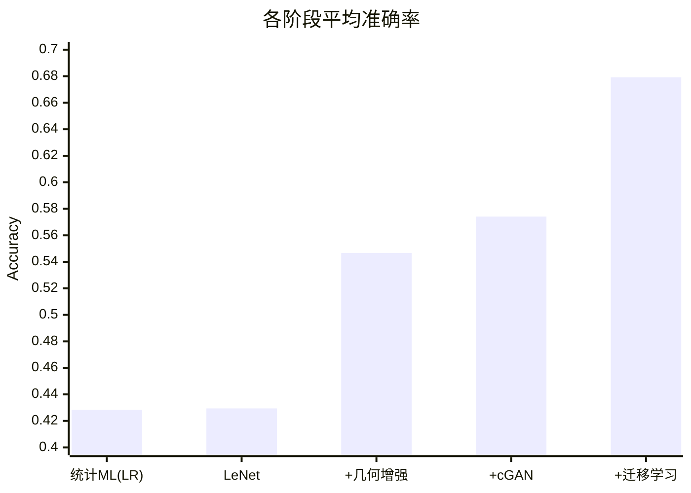

# MNIST One-Shot 实验报告

## 1. 实验目标

在**仅有 10 张训练样本**(每个数字类别 1 张)的极端小样本条件下训练 MNIST 分类器,系统比较不同建模策略的表现,并通过**数据增强 → 生成式增强 → 迁移学习**逐级提升测试准确率。数据构造细节参见 [数据集报告](./dataset_report.md)。

---

## 2. 实验设置

### 2.1 环境与依赖

`scikit-learn`、`torch`、`torchvision`、`numpy`、`matplotlib`、`Augmentor`(见 [`../requirements.txt`](../requirements.txt))。

### 2.2 随机种子

每种方法在 **3 个种子**(`31 / 317 / 31731`)下各跑一次并取平均,以观察样本选择带来的方差。

### 2.3 关键超参数

**深度分类模型**(`deep_learning`):

| 超参 | 值 |
| --- | --- |
| 优化器 | Adam |
| 学习率 `lr` | `3e-3` |
| 权重衰减 | `1e-3` |
| batch size | 64 |
| epoch | 301 |
| 损失函数 | `CrossEntropyLoss` |
| 输入尺寸 | 上采样到 224×224 |

**cGAN**(`gan_augment`):

| 超参 | 值 |
| --- | --- |
| `z_dim` | 100 |
| 优化器 | Adam,`betas=(0.5, 0.999)` |
| 学习率 | G `9e-4` / D `3e-4` |
| epoch | 300 |
| batch size | 64 |
| 损失函数 | `BCELoss` |

### 2.4 评估指标

在完整 MNIST 测试集(10,000 张)上的分类 **accuracy**。

---

## 3. 方法概览

| 阶段 | 方法 | 模型 |
| --- | --- | --- |
| ① Baseline(统计 ML) | 直接在 10 张样本上拟合经典分类器 | RF / GBDT / SVM / LR / KNN |
| ② Baseline(深度) | 从零训练小型 CNN | LeNet + Dropout |
| ③ 几何增强 | Augmentor 扩增到 1024 张 | LeNet + Dropout |
| ④ 生成式增强 | 几何增强 + cGAN 生成样本 | LeNet + Dropout |
| ⑤ 迁移学习 | 几何增强 + cGAN + ImageNet 预训练骨干 | 预训练 ResNet |

> **代码-文档一致性说明**:README 将阶段 ⑤ 记录为 *pretrained ResNet-34*,但当前 [`../models/nets.py`](../models/nets.py) 中 `MnistResNet` 实际使用 `resnet18(pretrained=True)`。二者存在不一致,复现时以代码为准或按需切换骨干网络。

---

## 4. 实验结果

### 4.1 阶段 ①:统计机器学习 Baseline

| 模型 / 准确率 | 随机森林 | GBDT | SVM | LogisticRegression | KNN (k=1) |
| --- | --- | --- | --- | --- | --- |
| seed=31 | 0.3978 | 0.2869 | 0.3957 | 0.4145 | 0.3975 |
| seed=317 | 0.4446 | 0.2830 | 0.4406 | 0.4479 | 0.4406 |
| seed=31731 | 0.3894 | 0.2138 | 0.4296 | 0.4227 | 0.4296 |
| **平均** | 0.4106 | 0.2612 | 0.4220 | **0.4284** | 0.4226 |

### 4.2 阶段 ②:LeNet + Dropout(无增强)

| | LeNet with Dropout |
| --- | --- |
| seed=31 | 0.4213 |
| seed=317 | 0.4315 |
| seed=31731 | 0.4354 |
| **平均** | 0.4294 |

### 4.3 阶段 ③:几何数据增强(1024)

| | LeNet + Augmentor (1024) |
| --- | --- |
| seed=31 | 0.5490 |
| seed=317 | 0.5612 |
| seed=31731 | 0.5301 |
| **平均** | **0.5467** |

### 4.4 阶段 ④:几何增强 + cGAN(不同 `gan_ratio`)

| | ratio=0.1 | ratio=0.2 | ratio=0.4 | ratio=0.6 | ratio=1.0 |
| --- | --- | --- | --- | --- | --- |
| seed=31 | 0.5844 | 0.5569 | 0.5755 | 0.5598 | 0.5030 |
| seed=317 | 0.5552 | 0.5901 | 0.5424 | 0.5180 | 0.5573 |
| seed=31731 | 0.5828 | 0.5452 | 0.5612 | 0.5469 | 0.5627 |
| **平均** | **0.5741** | 0.5640 | 0.5579 | 0.5415 | 0.5410 |

### 4.5 阶段 ⑤:几何增强 + cGAN + 迁移学习

| | Augment(1024) + cGAN(ratio=0.1) + 预训练 ResNet |
| --- | --- |
| seed=31 | 0.6823 |
| seed=317 | 0.7265 |
| seed=31731 | 0.6289 |
| **平均** | **0.6792** |

---

## 5. 结果分析

### 5.1 逐级提升趋势



| 阶段 | 平均准确率 | 相对上一阶段增益 |
| --- | --- | --- |
| 统计 ML(最佳 LR) | 0.4284 | — |
| LeNet | 0.4294 | +0.0010 |
| + 几何增强 | 0.5467 | **+0.1173** |
| + cGAN(0.1) | 0.5741 | +0.0274 |
| + 迁移学习 | 0.6792 | **+0.1051** |

### 5.2 关键观察

- **深度模型在无增强时并不优于统计 ML**:LeNet(0.4294)与 LogisticRegression(0.4284)几乎持平——10 张样本不足以体现深度网络的容量优势,反而易过拟合。
- **几何增强是性价比最高的手段**:单此一项带来约 **+12 个百分点**的提升,说明在小样本下扩充数据分布比更换模型更关键。
- **cGAN 增强需控制比例**:`gan_ratio=0.1` 时最优(0.5741),随比例增大准确率**单调下降**(1.0 时降至 0.5410)。原因是生成样本质量有限,过量注入会稀释真实分布、引入噪声标签。
- **迁移学习贡献最大单点增益**:引入 ImageNet 预训练骨干带来约 **+10.5 个百分点**,验证了预训练特征在小样本任务中的强迁移能力。
- **方差随能力增强而扩大**:预训练 ResNet 在不同 seed 间波动明显(0.6289 ~ 0.7265,极差 0.0976),说明最终性能对"抽到哪 10 张样本"仍高度敏感。

---

## 6. 结论

1. 在 one-shot(10 样本)条件下,**数据增强 + 迁移学习**是提升准确率的两大主力,分别贡献约 +12 和 +10.5 个百分点。
2. **生成式增强(cGAN)应少量使用**,推荐 `gan_ratio ≈ 0.1`,过量反而有害。
3. 最优组合(几何增强 + cGAN 0.1 + 预训练 ResNet)平均达到 **0.6792**,相比统计 ML baseline(0.4284)提升约 **25 个百分点**。
4. 结果对样本抽样高度敏感,报告多 seed 平均值比单次结果更可信。

---

## 7. 复现方式

当前 [`../train.py`](../train.py) 的 `main()` 默认仅运行 `deep_learning`(几何增强 + `MnistResNet`)。复现不同阶段需相应调整:

```bash
# 阶段 ⑤:几何增强 + cGAN(0.1) + 预训练 ResNet(默认模型)
python train.py --seed 31 --gan_ratio 0.1
python train.py --seed 317 --gan_ratio 0.1
python train.py --seed 31731 --gan_ratio 0.1

# 阶段 ③:仅几何增强(不加 GAN)
python train.py --seed 31 --gan_ratio 0
```

| 命令行参数 | 默认值 | 说明 |
| --- | --- | --- |
| `--seed` | 31 | 随机种子(决定抽取哪 10 张样本) |
| `--lr` | 3e-3 | 学习率 |
| `--num_ep` | 301 | 训练轮数 |
| `--gan_ratio` | 0 | cGAN 生成样本比例,`>0` 时启用 |

复现其它阶段需修改代码:

- **阶段 ①(统计 ML)**:在 `main()` 中取消注释 `statistical_ml(dataset)`。
- **阶段 ②/③(LeNet)**:在 `deep_learning` 中将 `MnistResNet()` 换为 `LeNet()`。

---

## 8. 局限与后续工作

- **Siamese 网络存在缺陷**:`siamese_net` 在 `train.py` 中被标注为 `buggy`,当前未纳入有效对比。
- **文档-代码不一致**:README 记为 ResNet-34,代码实为 resnet18(见 §3 说明),建议统一。
- **验证集闲置**:`valid_set` 未用于超参搜索或早停。
- **下载源风险**:`deeplearning.net` 已不稳定,建议迁移到 `torchvision.datasets.MNIST`。
- **未做统计显著性检验**:仅 3 个 seed,建议增加重复次数并报告置信区间。

---

## 9. 参考资料

- 原始项目仓库:<https://github.com/borgwang/toys/tree/master/ml-mnist-one-shot>
- 作者博客(中文):<https://borgwang.github.io/dl/2019/11/29/mnist-one-shot.html>
